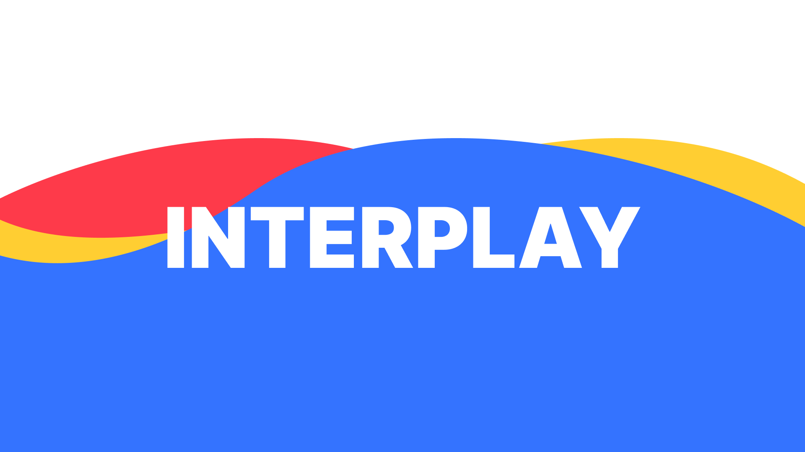
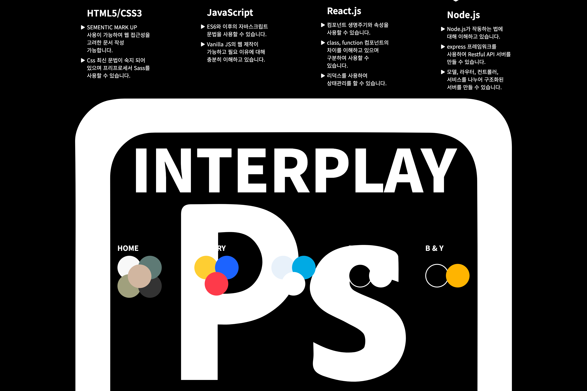
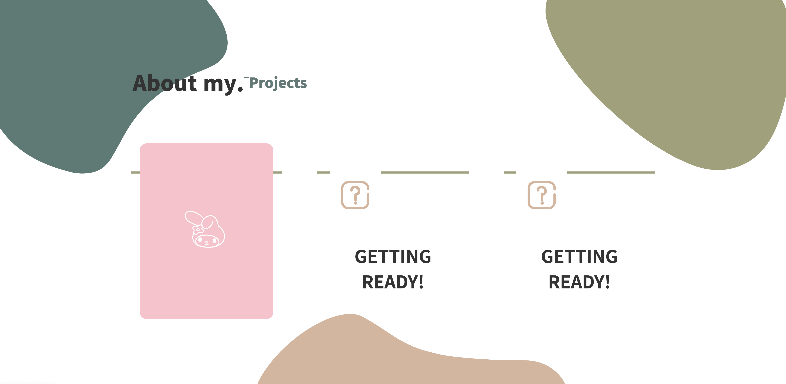

## 나현국의 포트폴리오 메인 홈페이지.

안녕하세요 나현국입니다.
2023년 10월 21일부터 홈페이지 디자인을 시작하였습니다.

### 홈페이지 테마

#### 메인 주제는 "interplay" 입니다.

`상호작용`이라는 뜻이며 사용자와 함께 교감하는 웹환경을 만들고자 하는 의미에서 메인주제로 설정하였습니다.
보통 개발과 관련된 경우에는 `interaction` 이라는 단어를 사용합니다.
`interplay`와 `interaction` 모두 번역하면 `상호작용`이라는 뜻이지만 `play`라는 단어에서 사용자의 경험에 `재미`라는 작용을 더하는 개발자가 되고자하여 `interplay`를 사용했습니다.

#### 2023-11-11

- 깃을 사용한 브랜치 관리를 하고자하여 깃허브에 업로드 시작.
- 현재까지 작업률, 홈페이지 비쥬얼 구현.

#### 추가 작업.

- con1 - html,css 구현 완료
- con2 - sub_heading 까지 구현 완료

#### 2023-11-12

- con2 - main contents 까지 총 70% 가량 구현 완료
- 깃허브 push 하였으나 css 미적용 버그 발생하여 scss 파일 주석을 `//` 에서 `/**/`로 변경하여 디버깅 완료

#### 2023-11-16

- con2 - main contents 구조 및 js 동작까지 구축완료
- 깃허브 push 후 확인시 css스타일 버그 발생하여 확인 후 디버깅 완료

  - 디버깅 내용 : main.scss 에서 선택자, 선택자 syntax가 크롬에서 동작안됨 확인하여 각각 따로 스타일 적용하여 디버깅

    

### 디버깅 전

   
   
### 디버깅 후   
   
   
   
#### 2023-11-17

- con3 - 구축 완료
- con4 - 레이아웃 구축 완료
- footer - 구축 완료

#### 2023-11-18

- SCSS 변수 지정 사용 및 HTML, CSS W3C Validator 로 검사 후 최적화
- Footer 에 `<heading>` 태그를 사용하였던 부분 일반적이지 않으므로 수정하여 `
, 
` 태그로 수정
- header 에 `<h1>` 태그를 사용하는 것이 웹표준 및 웹접근성에 맞으므로 수정하여 내용은 넣었으나 가시적으로는 노출이 없어야하므로 넓이/높이 값을 `0`으로 주고 overflow:hidden으로 가리는 것으로 수정
- `shapes` 요소들을 `position:sticky`로 화면에 고정 시킨 후 `scroll` 위치에 따른 `transform`으로 위치 및 모양 변경값 설정
- `pavicon` 삽입

#### 추가 작업

- `position:sticky` 로 요소 일부분을 화면 밖으로 삐져나가게 하려고 했으나 동작하지 않으므로 결국 `top:0;` 속성값만 부여하고 `transform`속성으로 짜기로 결정

#### 2023-11-19

- `scroll` 이벤트에 따른 도형의 위치 및 모양 변화 구축
- 기존의 `visul` 이었던 유튜버 `Interactive Developer` 님의 강의를 듣고 만든 `wave` 요소는 너무 무거워서 아예 다른 `wave`로 구축

#### 2023-11-19

- `visual` 페이지가 마음에 안들어서 코드 수정

#### 2023-11-21

- 테마 컬러 css에서 js 로 불러온 후 themeColorChange 함수로 변경 코드 작성, html 요소들에 클래스명 부여한 하면 해당 기능 구축완료

#### 2023-11-22~23

- 테마 컬러 `HOME, PRIMARY, COZY, B&W, B&Y `모두 적용 완료
- `Navigation` 클릭 시 스크롤 이동 기능 구축
- `Footer`의 높이가 작아서 스크롤 시 오류가 생김으로 `height`값을 더 줘서 디버깅 완료

#### 2023-11-24

- con3 `방향 감지 호버`를 통한 이벤트 구축
- 출처 : https://freelance-drupal.com/en/blog/direction-aware-hover-effect-in-pure-css3-and-javascript

### Agenda

- con1 more about me 버튼 클릭 시 모달 창으로 설명 나오게하기
- con2 내용 전체적으로 변경할 필요 있음
  - Design Tools 의 경우 이미지를 넣는 것이 어떨지 구상해보기
- con3 유닛 클릭 시 모달창으로 프로젝트 상세페이지 나오도록 구성
- PC 미디어-쿼리 4개로 쪼개기
